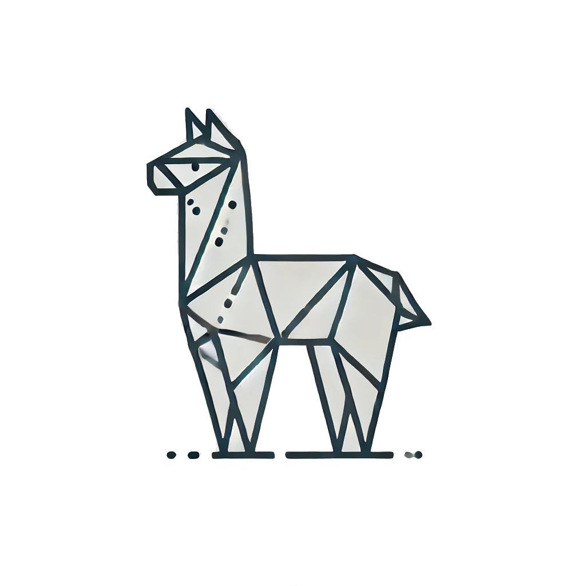
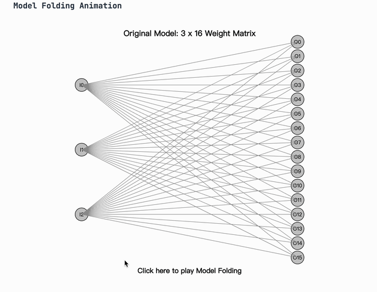
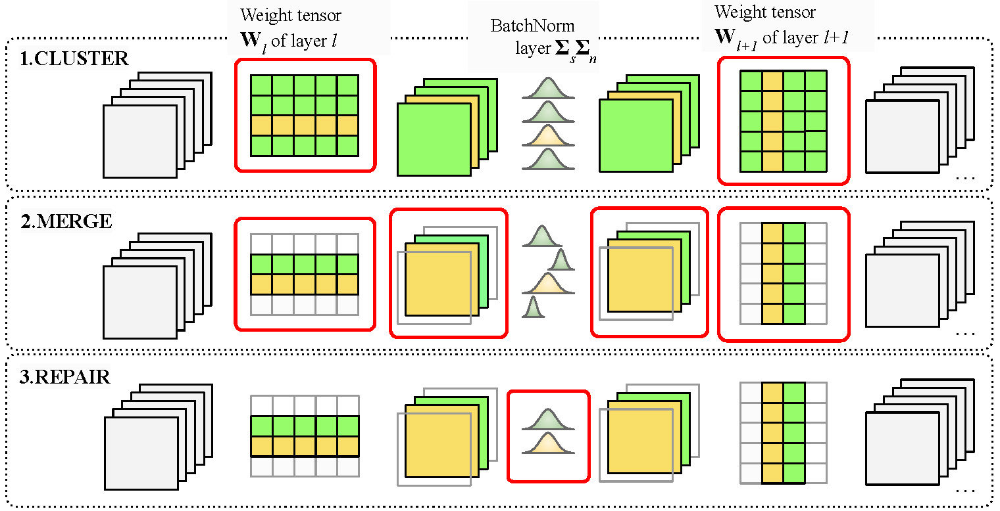

<div align="center">
  <h1>Forget the Data and Fine-Tuning! Just Fold the Network to Compress @ ICLR 2025</h1>
  <br />
<a href="https://arxiv.org/abs/2502.10216" target="_blank"></a>
<a href="https://wangdongdong.wang/publication/modelfolding" target="_blank"></a>
<a href="https://github.com/nanguoyu/model-folding-universal" target="_blank"></a> <br />

 <a href="#model-folding">🎉 Introduction</a> | <a href="#Installation">⚙️ Installation Guide</a> | <a href="#Preparation">📂 Preparation</a> | <a href="#Folding">🔄 Folding</a> | <a href="#citation">📑 Citation</a>

</div>

<div align="center">

[Dong Wang](https://wangdongdong.wang)\*, 
[Haris Šikić](https://github.com/marza96)\*, 
[Lothar Thiele](https://people.ee.ethz.ch/~thiele/), 
[Olga Saukh](https://sites.google.com/view/olgasaukh/home),\
Graz University of Technology, Austria  \
Complexity Science Hub Vienna, Austria \
ETH Zurich, Switzerland

\*: Equal Contribution.

</div>

<h2 id="model-folding">🎉 Introduction</h2>

**Model Folding** is a data-free model compression technique that merges structurally similar neurons across layers, reducing model size without fine-tuning or training data. It preserves data statistics using $k$-means clustering and novel variance control techniques. Experiments on ResNet18 and LLaMA-7B show that Model Folding matches data-driven compression methods and outperforms recent data-free approaches, especially at high sparsity levels, making it ideal for resource-constrained deployments.

<div align="center">

</div>

<h2 id="Installation"> ⚙️ Installation</h2>

### (optional) Install Mamba or Use Conda

Mamba is recommended for faster installation. You can also use Conda for all the packages. They are functionally equivalent.

```Shell
curl -L -O "https://github.com/conda-forge/miniforge/releases/latest/download/Miniforge3-$(uname)-$(uname -m).sh"
bash Miniforge3-$(uname)-$(uname -m).sh
```

```Shell
conda init zsh
```

### Create Environment and Install Packages

We use FFCV for faster data loading, it only supports python<3.12. In case you do not want to use FFCV, you can just remove ~~`pip3 install ffcv`~~ and then our code will use the default torchvision data loader.

```Shell
mamba create -y -n model_folding python=3.11 opencv pytorch torchvision torchaudio pytorch-cuda=12.1 -c pytorch -c nvidia
mamba activate model_folding
mamba install  pandas scipy tqdm cupy pkg-config libjpeg-turbo numba -y
pip3 install torchopt ultralytics-thop wandb timm==0.9.16 torchist==0.2.3 matplotlib torchopt
pip3 install ffcv
pip3 install git+https://github.com/IBM/hartigan-kmeans.git
```

<h2 id="Preparation"> 📂 Preparation</h2>

### Prepare the dataset

For computer vision dataset
- In case you installed the FFCV, you can go to [prepare_dataset.py](./prepare_dataset.py) to generate `.beton` dataset files.
- In case you do not want to use FFCV, image dataset will be automatically downloaded from torchvision at the 1st time you run the code.

For LLM dataset, the dataset will be automatically downloaded from Hugging Face.

### Prepare the model

For computer vision models including ResNet, VGG, etc.

We use the implementation of [torchvision](https://github.com/pytorch/vision/tree/main) to load the model. For models trained on ImageNet, we reuse the pre-trained weights from [torchvision](https://github.com/pytorch/vision/tree/main).
For models trained on CIFAR10, CIFAR100, etc., we train the models from scratch (see [train.py](./train.py)).

For LLM models including LLaMA1, LLaMA2, etc.

We use the implementation of [Hugging Face Transformers](https://github.com/huggingface/transformers) to load the model. Please make sure your hugging face account is logged in and authorized to access the models by Meta.

### Prepare the weights

For computer vision models trained on ImageNet, we reuse the pre-trained weights from [torchvision](https://github.com/pytorch/vision/tree/main).
For models trained on CIFAR10, CIFAR100, etc., we train the models from scratch (see [train.py](./train.py)).
For LLM models, we use the pre-trained weights from Meta and loaded by [Hugging Face Transformers](https://github.com/huggingface/transformers).

You can use the following commands to train the models. With --wider_factor to train the wider model, you can control the width of the model.
The well-trained models will be saved in the `./weights` folder, with a name of `{model}_{dataset}.pth` or `{model}_{wider_factor}Xwider_{dataset}.pth`.

**Training resnet18 on CIFAR10**
```Shell
CUDA_VISIBLE_DEVICES=6 python train.py --dataset=CIFAR10 --model=resnet18 --batch_size=128 --epochs=100 --learning_rate=0.1 --wider_factor=1
```

**Training vgg11_bn on CIFAR10**
```Shell
CUDA_VISIBLE_DEVICES=6 python train.py --dataset=CIFAR10 --model=vgg11_bn --epochs=100 --learning_rate=0.1 --wider_factor=1
```

**Training resnet50 on CIFAR100**
```Shell
CUDA_VISIBLE_DEVICES=1 python train.py --dataset=CIFAR100 --model=resnet50 --batch_size=512 --epochs=100 --learning_rate=0.1 --wider_factor=1
```

<h2 id="Folding"> 🔄 Folding</h2>


> As model folding in an ongoing research, we provide two versions of code for you to try.
> In one version, you can reproduce the results in the paper for all computer vision models. 
> In the other version, you can try the latest code for both LLM models evaluated in the paper and computer vision models for the ongoing research.





### Folding Computer Vision Models

**Option 1 (suggested)**: To reproduce the results in the paper for all computer vision models, you can go to [./modelfolding_cv](https://github.com/marza96/ModelFolding/tree/33e2818e017c250aacbff62003e83bd87236ed17).

Option 2: To use this universal folding code for most computer vision models, you can use the following command:
```Shell
CUDA_VISIBLE_DEVICES=2 python folding.py  --gpus=0 --dataset=CIFAR10 --wider_factor=1 --weight='./weights/resnet18_CIFAR10.pth' --model=resnet18 --model_perm_config_path='./config/resnet18_perm.json'
```
Note: the computer vision models used for both options are the same. You try cv models with [train.py](./train.py) and use the weights for both options.

### Folding LLM Models
For example, to fold `Llama-1-7b`, you can use the following command:
```Shell
CUDA_VISIBLE_DEVICES=0 python folding.py  --gpus=0 --dataset=wikitext2  --model=llama_1_7b_hf --model_perm_config_path='./config/llama_1_7b_hf_perm.json'
```
You can adjust the folding ratio by changing the parameter `pr` in the `llama_1_7b_hf_recipe.py` file.

If you want to do zero-shot evaluation, please install evaluation code from a modified version of EleutherAI LM Harness from [Wanda Github repo](https://github.com/locuslab/wanda?tab=readme-ov-file#zero-shot-evaluation) and set `--zero_shot_eval`.

```Shell
CUDA_VISIBLE_DEVICES=0 python folding.py  --gpus=0 --dataset=wikitext2  --model=llama_1_7b_hf --model_perm_config_path='./config/llama_1_7b_hf_perm.json' --zero_shot_eval
```

<h2 id="citation">📑 Citation</h2>

```BibTeX
@inproceedings{wang2025forget,
  title     = {Forget the Data and Fine-tuning!\\Just Fold the Network to Compress},
  author    = {Dong Wang and Haris \v{S}iki\'{c} and Lothar Thiele and Olga Saukh},
  booktitle = {Proceedings of the International Conference on Learning Representations (ICLR)},
  year      = {2025},
  url       = {https://openreview.net/forum?id=W2Wkp9MQsF} 
}
```

<hr>
<p align="center">Model Folding Team w/ ❤️</p>